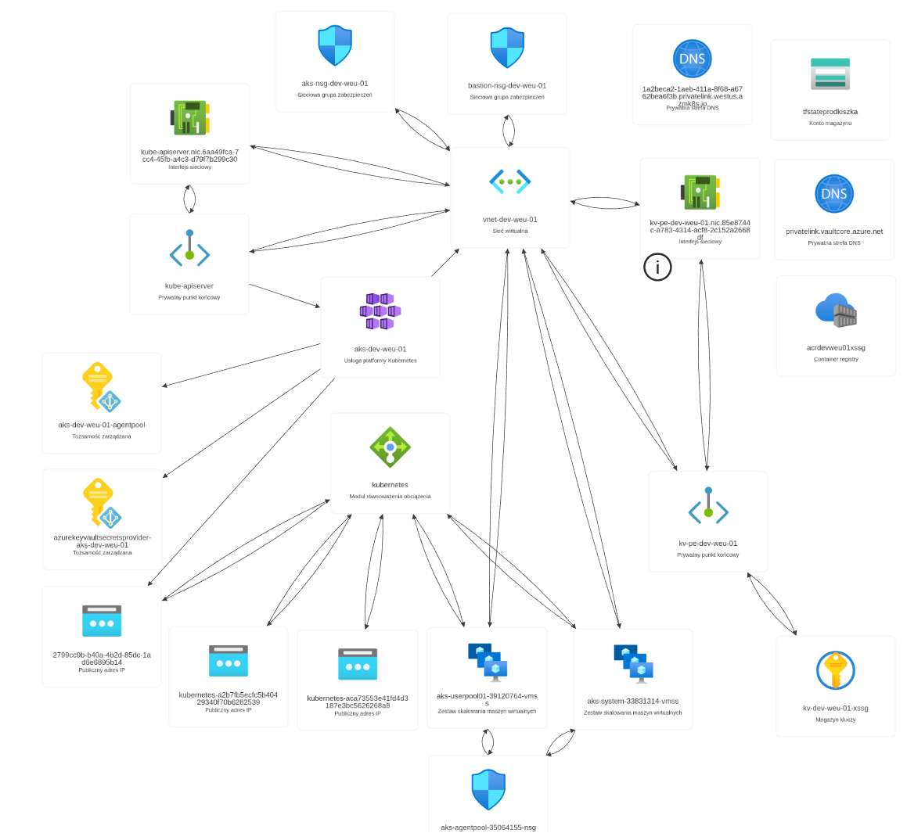
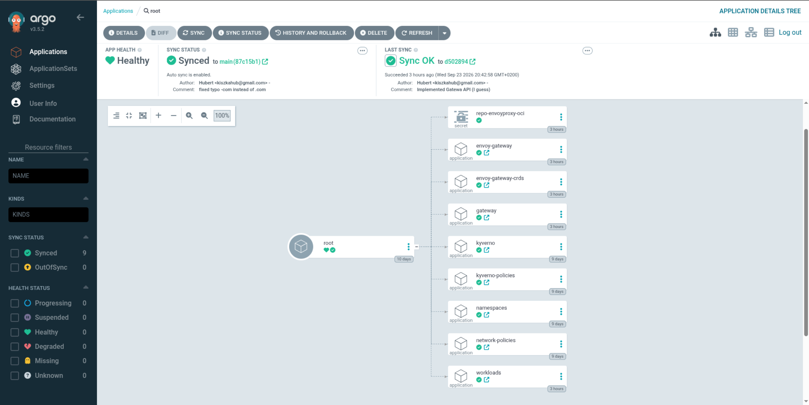
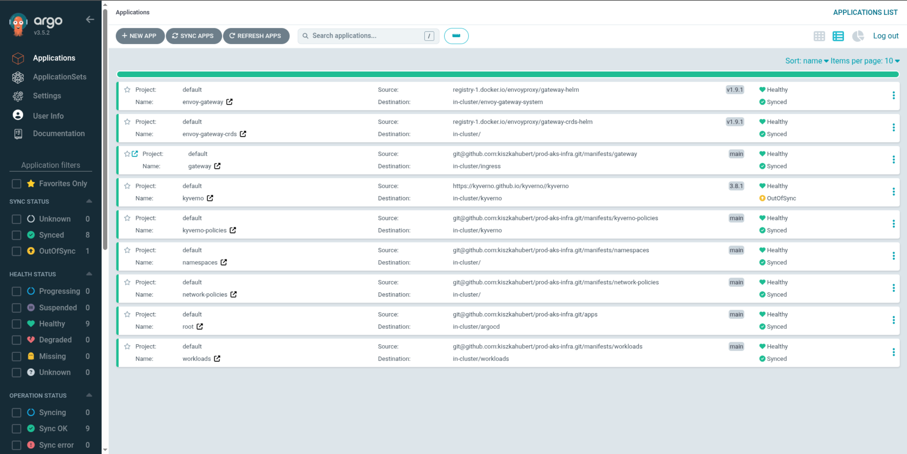
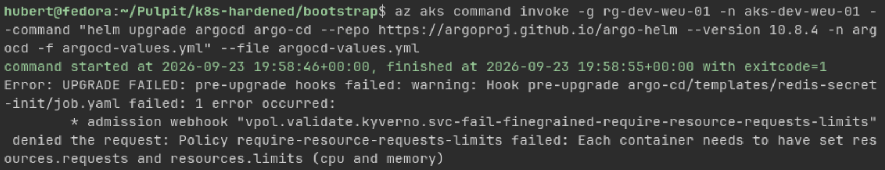

# Azure AKS hardened infrastructure
The goal of this project was to create production level infrastructure for Kubernetes cluster on Azure cloud platform. There are some limitations in proposed solution stemming from the used Azure subscription (e.g. limit to 4 vCPU).

## Tools and Security Controls
1. Kubernetes
2. Key Vault
3. Microsoft Entra Workload Identity
4. Azure RBAC
5. Bastion/jump-host
6. ArgoCD
7. Pod Security Admission
8. Kyverno policies
9. Terraform



## Init steps
Infrastructure has been provisioned using Terraform which is an IaC tool allowing for repeatable and quick provisioning from configuration file. To achieve best prod standards state file has been stored in remote backend (Azure Storage Account) utilizing commands bellow. 

```
az group create --name rg-tfstate-prod --location westeurope

az storage account create \
  --name tfstateprodkiszka \
  --resource-group rg-tfstate-prod \
  --location westeurope \
  --sku Standard_LRS \
  --min-tls-version TLS1_2 \
  --allow-blob-public-access false \
  --allow-shared-key-access false \
  --https-only true

az storage container create \
  --account-name tfstateprodkiszka \
  --name tfstate \
  --auth-mode login
```
However storage account has two planes - **Control plane** which is used to manage storage accounts, it does not need any role to access other than Owner or Contributor on subscription or resource group level. There is also **Data plane** which is used to acess data inside the Storage Account, however it needs an additional role even if you are **Owner**. Needed role to assign is **Storage Blob Data Contributor**
```
MY_ID=$(az ad signed-in-user show --query id -o tsv)
STORAGE_ID=$(az storage account show --name tfstateprodkiszka --resource-group rg-tfstate-prod --query id -o tsv)

az role assignment create \
  --assignee "$MY_ID" \
  --role "Storage Blob Data Contributor" \
  --scope "$STORAGE_ID"
```
This step has to be done manually as Terraform cannot provision something it needs in the first place to work.

## Limitations
Key idea was to create private AKS cluster and access it via bastion/jump host VM. Making cluster private has a lot of benefits. Main one is that kube-api cannot be directly called via public Internet as it only recieves private IP in the VNet. However there is still need of solution which would allow to communicate with cluster via **kubectl**. There are 3 possible ways to achieve that I am aware of:
1. **VPN (Point-to-Site)** - Allows to connect PC with AKS VNet, convenient but requires configuration of Virtual Network Gateway
2. **Azure Bastion or Jump host VM** - You can either use managed Azure service called Azure Bastion or create your own VM which would work as Jump host which is a commonly used on-prem pattern which I have also at first implemented in my solution
3. **az aks command invoke** - kubectl command is being executed by ARM in cluster - there is no need of VPN or jump host you can send commands from your local host, but the main disadvantage is that its painfully slow as it needs to first create pod in the cluster execute command then delete pod and come back with response.

As I have used jump host pattern previously I have decided to use it again this time. However there is a problem - Azure allows to extend vCPU limit only for pay-as-you-go subscription. As I am on different subscription I have a hard cap of 4 vCPU though I have decided to go for it. Ive created AKS cluster with only one system node which use 2 vCPU and then created jump host utilizing other 2 vCPU. Everything was fine until I have installed ArgoCD, kyverno and my pods were constantly OOMKILLED as the node had high CPU usage and also there were no room to schedule new pods as requests were maxed out (Will elaborate on that later). So I had to opt out of the jump host idea to regain back 2 vCPU which allowed me to create an additional user nodepool for AKS. However after getting rid of jump host I had no way to communicate with Kubernetes cluster. That is why I have decided to go for the simplest solution which was to use **az aks command invoke**. I only needed to slightly change kyverno policies and add one NSG rule (would elaborate on both of those topic later). Normally I would need to type it like this all the time `az aks command invoke -g rg-dev-weu-01 -n aks-dev-weu-01 --command "kubectl <args>"`. However its a waste of time to do it each time like that so I just created shell command in `~/.bashrc` like so 
```
azk() {
  az aks command invoke \
    -g rg-dev-weu-01 -n aks-dev-weu-01 \
    --command "$(printf '%q ' "$@")"
}
```
## Infrastructure
Every resource that needs an IP address will be created in one of three subnets based on its purpose. Main VNet has address space of 10.0.0.0/16. There are 3 subnets used in the proposed solution
|Name|Address space|Purpose|
|----------|-------------|-------|
|aks-subnet|10.0.1.0/24|Pool of addresses assigned to nodepools|
|bastion-subnet| 10.0.2.0/28|Pool of addresses assigned to bastion hosts|
|kv-subnet|10.0.4.0/28|Pool of addresses assigned to Key Vault|

As I have mentioned this solution once used **jump host VM** so it is worth explaining its configuration. Access to VM was available only with ssh `disable_password_authentication = true`. It is worth mentioning that with CI/CD such configuration would not work as ssh file would need to be passed by variable and now it is being pulled from host. VM utilizes Managed Identity `identity{type="SystemAssigned"}` which creates Entra ID Service Account connected with this VM so it can authenticate against other Azure services without passwords, keys or secrets. Additionaly VM has assigned NIC with public IP address. To NIC I have assigned NSG to harden acess to jump host.
|Rule Name|Priority|Purpose|
|---------|--------|-------|
|allow-admin-ip-inbound|100|Allow SSH access to VM only from `var.admin_ips` addresses|
|allow-https-outbound|100|Used to access `az` and `kubectl`|
|allow-dns-outbound|120|DNS only to `168.63.129.16` which is an Azure DNS resolver|
|deny-all-outbound|1000|Block the rest of outbound traffic|
|deny-all-inbound|1000|Block the rest of inbound traffic|

However utilizing `kubectl` command is not yet available as there is no **kubeconfig** and also **Managed Identity** have no rights to pull this config file and even if it could pull, it does not have access to Kubernetes data plane. So for it to work I have created two `azurerm_role_assignment` resources. First one called `bastion_aks_admin` gives `Azure Kubernetes Service RBAC Cluster Admin` role which is not ideal as it gives a full cluster data plane access and it should rather be namespace scoped. Second resource called `bastion_aks_cluster_user` gives `Azure Kubernetes Service Cluster User Role` role which allows access to pull the **kubeconfig** file on jump host. With those roles assigned I was able to run those commands to configure jump host so I could use `kubectl` tool.
```
curl -sL https://aka.ms/InstallAzureCLIDeb | sudo bash
az aks install-cli
az login --identity #Login as Managed Identity for which access I have just configured
az aks get-credentials \ #Get kubeconfig file
  --resource-group rg-dev-weu-01 \
  --name aks-dev-weu-01 \
  --overwrite-existing
kubelogin convert-kubeconfig -l msi #Instructs kubectl to obtain token for Managed Identity, without this each request would end up with HTTP 403
```
Before explaining main part which is AKS lets explain Azure Container Registry and Key Vault configuration. ACR needs globaly unique name so it gets a random suffix appended to name to achieve that. First idea was to obtain access to ACR from AKS with private endpoints but as stated in the comment in code such solution would require to use most expensive SKU which is the only one that supports private communication. So not so ideally all the communication with ACR takes place over the public Internet. ACR will be the only available place from which AKS can pull images (except those needed to create core resources like ArgoCD). It also has set `admin_enabled = false` so authorization can only take place using Entra ID. In order for AKS to pull images from ACR role `aks_acr_pull` was created. It works like this:
1. Pod needs an image form *.azurecr.io registry
2. **Kubelet** asks (utlizing built in ACR credential provider) for an Entra ID token on behalf of **kubelet identity**
3. Token is exchanged in ACR for registry token
4. ACR checks in Azure RBAC whether this identity has a **pull** authorization and gives the image

It is worth mentioning that there is no `imagePullSecrets` in application manifests, authentication takes place on node level not on pod level. Also `skip_service_principal_aad_check = true` resolves issue with checking whether kubelet indetity exists on first apply. Without the flag there will be an issue as kubelet indentity is being created with cluster but replication in Entra ID is delayed.

Moving forward to Key Vault which is quite the opposite as it is completely isolated form the public Internet. It will be used to securely store secrets from AKS which will access it via private endpoint in `kv-subnet`. Key Vault resource has prety self explanatory configuration, the `purge_protection_enabled` set to `false` is not ideal in prod environment but its is necessary to easily delete infrastructure. SKU was set to `standard` as in contrary to ACR all KV SKUs allows to utilize Private Endpoints that are created with resource `azurerm_private_endpoint`. All it does bascially is to create NIC with private IP in `kv-subnet` which leads to Key Vault. However creating only Private endpoint would not work. Applications connect to **FQDN** `kv-dev-weu-01-xssg.vault.azure.net` which in public DNS would resolve to public IP. So te mechanism is needed that would allow to resolve mentioned **FQDN** to private IP of Key Vault. For that we need three resources:
1. `azurerm_private_dns_zone` - it creates private DNS zone and creates **CNAME** record basicaly translating `kv-dev-weu-01-xsg.vault.azure.net` -> CNAME -> `kv-dev-weu-01-xssg.privatelink.vaultcore.azure.net`
2. `azurerm_private_dns_zone_virtual_network_link` - it informs Azure DNS Resolver (168.63.129.16) that queries from `vnet-01` have to include this zone.
3. `private_dns_zone_group` - it orders Private Endpoint to create A record `kv-dev-weu-01-xssg A 10.0.4.4`

To better understand lets see it on example:
1. Pod in AKS want to connect to Key Vault. It only knows the name `kv-dev-weu-01-xssg.vault.azure.net` but does not know the IP so it has to ask DNS first.
2. Pod asks **CoreDNS** which is available on `dns_service_ip` in this case `10.1.0.10`
3. **CoreDNS** only resolves names inside cluster (**cluster.local**) but Key Vault name is not one of them so it forwards query to DNS server used by node itself.
4. Node asks **Azure resolver** which is available on `168.63.129.16`
5. Resolver checks the Key Vault name in public DNS however as it utilize Private Endpoint it does not return **A record** but **CNAME** which in this case is `kv-dev-weu-01-xssg.privatelink.vaultcore.azure.net`
6. Resolver sees theprivate DNS Zone `privatelink.vaultcore.azure.net` and sees that in this zone there is **A record**.
7. Address from **A record** comes back back the same way which is: Azure Resolver -> node -> CoreDNS (caches it with TTL) -> pod.
8. Pod connects to the private IP address of Key Vault.

Moreover to admins and AKS to be able to manage and read secrets we need two assign two roles:
1. `kv_aks_csi` with role `Key Vault Secrets User`. It is used for AKS to be able to **ONLY** read secrets from Key Vault. More specifically it allows `principal_id` to do this and in this case this is **Secrets Store CSI Driver add-on**
2. `kv_admin_group ` with role `Key Vault Secrets Officer`. In this case it is group assigned not to one specific person. It is better solution as we can add and remove admins from group without ever changing terraform configuration. This specific role allows to read, edit and delete secrets in Key Vault.

To create new Entra ID groups and assign users to those groups we can utilize those commands
```
az ad group create --display-name "aks-admins" --mail-nickname "aks-admins"
az ad group create --display-name "kv-secrets-admins" --mail-nickname "kv-secrets-admins"

AKS_ADMIN_GROUP_ID=$(az ad group show --group "aks-admins" --query id -o tsv)
KV_ADMIN_GROUP_ID=$(az ad group show --group "kv-secrets-admins" --query id -o tsv)
MY_ID=$(az ad signed-in-user show --query id -o tsv)

az ad group member add --group "aks-admins" --member-id "$MY_ID"
az ad group member add --group "kv-secrets-admins" --member-id "$MY_ID"
```

Now lets move towards AKS configuration. Main configuration point is that `private_cluster_enabled` is set to `true` that means that API server has only private IP address in VNet and there is no way to connect from public Internet. AKS creates Private Endpoint to API server and private DNS zone assigned to VNet. Thats why previously mentioned connection methods are required. Parameter `local_account_disabled` disable local admin account so the only way to communicate with API server is to authenticate with Entra ID. Block `azure_active_directory_role_based_access_control` activates this authentication with Entra ID also parameter `azure_rbac_enabled` set to true makes all the authorization go through Azure RBAC, so there is no need of creating `ClusterRoleBinding` in YAML. But with this configuration new problem arise, without any role assignment any user would not be able to pull `kubeconfig` or invoke any `kubectl` commnand. Thats why those 2 roles were created:
1. `aks_cluster_user_group` - assigns `Azure Kubernetes Service Cluster User` role to previously created `aks-admins` group. This role allows to pull the kubeconfig with `az aks get-credentials`
2. `aks_rbac_admin_group` - assigns `Azure Kubernetes Service RBAC Cluster Admin` role to previously created `aks-admins` group. This role gives full rights within Kubernetes cluster.

Cluster has Managed Identity created by `identity { type = "SystemAssigned" }` which is used to create Azure Resources like load balancer, public IP on behalf of admin. Moreover AKS has turned on options that makes sense in prod environment like `image_cleaner_interval_hours` that cleans node of unused images, `automatic_upgrade_channel` does what it says it upgrades kubernetes version automaticaly. Channel `stable` says it should get a newest patch of version `Minor - 1` and block `maintenance_window_auto_upgrade` decides when this update should take place like in this case Weekly on Sunday 3am. Moreover `node_os_upgrade_channel` set to `NodeImage` is used to automatically update node OS. Block `node_provisioning_profile` disable `Karpenter` and block `key_vault_secrets_provider` enables `Secrets Store CSI Driver` and creates its identity in cluster. Most important block here is `network_profile`. It defines how pods gets the IP addres (Azure CNI Overlay), who sends the traffic (cilium) and who takes care of network rules (cilium). `Azure CNI Overlay` unlike its predecessor does not utlize the subnet from AKS VNet it needs different network defined by `pod_cidr` which in this case is `10.2.0.0/16`. Parameter `service_cidr` defines the range of ips that can be assigned to Service type `ClusterIP` and parameter `outbound_type` defines that egress from AKS cluster will travel through standard Load Balancer. In the block `advanced_networking` are defined two configuration options. First which is `observability_enabled` enables Hubble which is a registry of network traffic, it allowed me to solve issue on which later. Second parameter allows for extended cilium policies. Cluster have 2 nodepools system one and user node pool that holds all the applications. Within Azure Infrastruture ingress and egress to AKS was limited with Network Security Group with following rules:

|Rule Name|Priority|Purpose|
|---------|--------|-------|
|allow-aks-internal-inbound|100|Allow traffic betwen nodes|
|allow-pod-cidr-inbound|105|Allow traffic between pods on different nodes|
|allow-lb-inbound|120|Allow Load Balancer to cluster|
|allow-http-inbound|130|Allow access to Load Balancer apps|
|deny-all-vnet-inbound|1000|block the access from the VNet|

## Kubernets Cluster
Proposed solution utilize GitOps approach to deploying workloads onto AKS cluster with tool called **ArgoCD**. For preparing cluster to work with argo are responsilbe bash scripts from **bootstrap** folder. All of them were run on jump host when it existed. The first one called `00-install-prereq.sh` simply installs helm, jq and ArgoCD CLI which frankly I was supposed to use but I have not. The `01-create-github-deploy-key.sh` script is used to create GitHub deploy key which is added also to Key Vault, it allows ArgoCD to authenticate against GitHub repo and pull changes from it. In this case its not needed as repo is public but if it would be private one day such script and later described configuration would be necessary. The `02-install-argocd.sh` script is self explanatory. It creates namespace namespace for ArgoCD and then label it with PSA rules. Then helm adds argocd repo and install it with `argocd-values.yml` and prints out admin password to web ArgoCD GUI. Lets go through and explain each setting in argocd-values.yml

|Setting|Value|Explanation|
|-------|-----|-----------|
|global.securityContext|runAsNonRoot, seccompProfile: RuntimeDefault| Pods needs to pass PSA restricted in ArgoCD|
|configs.params.server.insecure|false|ArgoCD server use self-signed certs to encrypt traffic|
|configs.cm.admin.enabled|true|Allow to login with password previously printed|
|configs.cm.exec.enabled|false|Deny access to containers via ArgoCD web gui|
|configs.cm.timeout.reconcilation|180s|Time after which ArgoCD would check repo for changes|
|configs.rbac.policy.default|role:readonly|Basic role for everyone that has no other role assigned|
|applicationSet.enabled|false|Application resources are write manually in this case|
|dex.enabled|false|dex is an authentication proxy that is used when OIDC cannot be used so not needed in this case|
|notifications.enabled|false|No need for notifications right now|
|server||API and web GUI for ArgoCD|
|repoServer||used to clone repository|
|controller||main component of ArgoCD that compares current cluster state with this held in git repository and synchronize the difference|
|redis||stores cached data for controller and server|
|redisSecretInit||job that launches before installation and update of chart|

Last script from bootstrap directory called `03-bootstrap-root-app.sh`. What it does basically is to take env variables and edit `argocd-repo-secretproviderclass.yml` file placing real values into template and then apply this changed template. This mechanism here is required so ArgoCD can safely pull information about git repository and ssh private key which it can use to authenticate. This YAML file is used to configure Secrets Store CSI Driver. It is required because Kubernetes itself cannot read data from Azure Key Vault. Without CSI driver we would need to create secrets manualy by `kubectl create secret` or use **External Secrets Operator** which would be a better solution in my case. It is because **CSI** was designed in order for application itself to mount volume and read secrets on the pod level without creating it as a Kubernetes Secret on node level and **External Secrets Operator** creates secret on node level only. So in this case using **CSI** needed workaround. **CSI** does not do anything by itself, it needs a triger like one when pod mounts the volume pointing to **SecretProviderClass**. In this case Deployment was created with image `mcr.microsoft.com/oss/kubernetes/pause:3.9` which just waits. Solution before change was based on `Pod` but it did not make sense cuz if pod was removed the secret was gone with it and everything stoped working and obiously `Deployment` takes care of required replicas. It has `securityContext` settings so it can pass PSA check. There is also resource of type `SecretProviderClass` it tells CSI how and from it should pull this secret. `provider` parameter tells CSI that it should use plugin for Azure Key Vault. `parameters` part defines how to authenticate and what to pull and `secretObjects` defines what to do with pulled values. On default it would only pull tose secrets and mount them as file in pod like `/mnt/secrets/<secret-name>`. However in this case it orders to create Secret object in kubernetes of name `argocd-gitops-repo-creds` and also labels it with `argocd.argoproj.io/secret-type: repository` which allows ArgoCD to find this secret.
### ArgoCD
ArgoCD utilize app-of-apps pattern which can be seen on image bellow. It means that there is only one Application manifest applied which is the root and other manifests apply automaticaly as they are tracked by root element. Then each child Application sync its own manifests from `manifests/` folder. This is better solution than one big Application manifest that has every Application inside because it allows to see status of each application itself and configure them differently if needed. Every application is synced correctly instead of kyverno and frankly I dont get why. It works fine but for some reason I cant figure out it always has `sync status` set to `OutOfSync`

```bash
hubert@fedora:~$ azk kubectl get applications -n argocd
```

| NAME                 | SYNC STATUS | HEALTH STATUS |
|----------------------|-------------|---------------|
| envoy-gateway        | Synced      | Healthy       |
| envoy-gateway-crds   | Synced      | Healthy       |
| gateway              | Synced      | Healthy       |
| kyverno              | OutOfSync   | Healthy       |
| kyverno-policies     | Synced      | Healthy       |
| namespaces           | Synced      | Healthy       |
| network-policies     | Synced      | Healthy       |
| root                 | Synced      | Healthy       |
| workloads            | Synced      | Progressing   |



### PSA
Pod Security Admission is built in Kubernetes mechanism which denies creation of pods with dangerous settings. As it is native solution its free in cost of money and resources on nodes. It has three different levels:
|level|blocking|
|-----|--------|
|privileged|nothing|
|baseline|privileged containers, `hostPath` volumes, adding Linux Capabilities different than default, disabling seccomp|
|restricted|containers must be run as root, privilege escalation is disabled, container has all Linux Capabilities dropped|

Each level can be checked on three different levels, `enforce` blocks creation of resource, `audit` allow to create resource but creates log in API server logs and `warn` just gives warning when excecuting `kubectl` but allows to create resource. It is also worth remember that `enforce` checks only pods not Deployments. So if there exists non compliant Deployment it will be created but there will be no available replicas. However although PSA seems like complete solution it lacks option to create own policies that is why in this project it was suplemented with Kyverno

### Kyverno
Kyverno is an admission controller, with creation or modification of Kubernetes object API sever asks admission controller for approval on those operations based on defined policies. It can work as a **ValidatingWebhook** as well as **MutatingWebhook** however in this case I was using only validation. Kyverno is managed by ArgoCD that creates and updates it using helm chart and values from `manifests/kyverno/values.yml`. Lets explain configuration options from this file
|Setting|Value|Reason|
|-------|-----|------|
|admissionController||Main resource of kyverno to which API Server sends all the validating queries|
|admissionController.serviceMonitor.enabled|false|Prometheus Operator object that tells Prometheus how to gather metrics, as it was not used in my case its turned off|
|backgroundController.enabled|false|Its used with mutating policies, as I dont use them I dont need this|
|cleanupController.enabled|false|Deletes resources based on schedule. Not needed here allows to save some resources|
|reportsController.enabled|false|If enabled it would create PolicyReport objects that I dont need|
|webhooksCleanup.enabled|true|On uninstalling chart it runs a job which removes Kyverno webhook configuration from API Server|
|config.webhooks.failurePolicy|fail|Defines what API server should do if Kyverno does not respond, in this case it should drop all calls|
|config.webhooks.namespaceSelector||Defines from what namespaces API Server should (in this case should not) send validating requests to Kyverno|
|crds.install|true|Chart install Kyverno CRDs|
|features.autoUpdateWebhooks.enabled|true|Enabling this make Kyverno configure webhooks to policies so only resources in this case pods are tracked and not any other resource. In result this reduce load on Kyverno|

Okay so this will be it about the Kyverno installation. Previousl policies were configured using `ClusterPolicy` however in Kyverno version 1.19 this resource is marked as deprecated and new solution has been introduced called `ValidatingPolicy`. Its far easier to use solution as previously everything was configured in pure YAML now it is written in CEL. In cluster there were created 4 policies:
|Policy name|Description|
|-----------|-----------|
|require-resource-requests-limits|Pods cannot be created with properly set resource and limits so they will not starve other pods|
|disallow-latest-tag|It disallow using latest tags with containers|
|restrict-image-registries|Images can only be pulled from previously describe ACR registry|
|disallow-default-namespace|No pods can be created in default namespace|

Example that those policies work can be seen below. After ArgoCD was constantly running out of memory and was constantly OOMKILLED I had to change limits for controller but no requests and limits were set for redisSecretInit so I have recieved error triggered by Kyverno policy that all pods needs to have requests and limits specified.


### Cillium
By default in Kubernetes all pods can talk with each other. Configured policies denies 